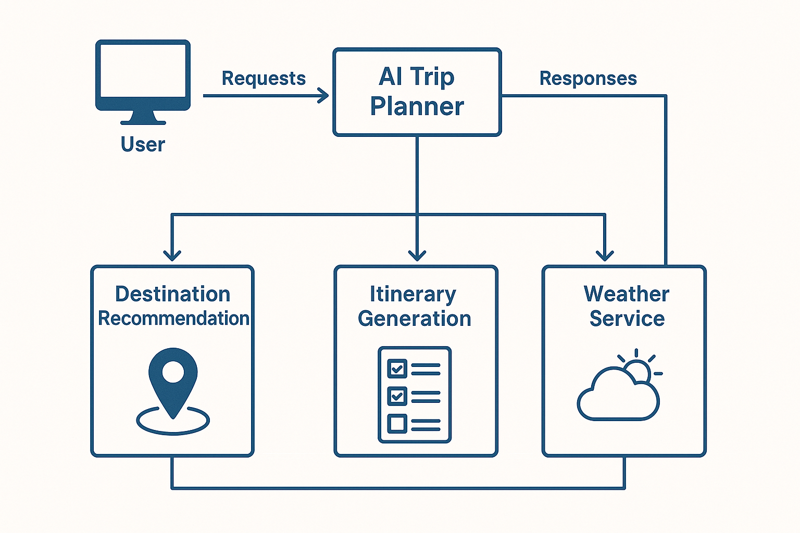

<p align="center">
  
</p>

<p align="center">
  <!-- Python Version -->
  

  <!-- License -->
  

  <!-- Build Status -->
  
</p>

# 🌍 AI Trip Planner

AI Trip Planner is an intelligent, agentic travel-planning system powered by Large Language Models (LLMs), custom tools, and LangGraph workflows. It generates personalized itineraries, suggests destinations, checks weather conditions, converts currencies, calculates expenses, and provides a complete AI-powered trip planning experience.

This project follows a clean, modular architecture using **Python**, **UV** (modern Python package manager), **FastAPI**, **Streamlit**, and reusable agents/tools.

---

## 🚀 Features

### 🗺️ Smart Itinerary Generation
- **Multi-step reasoning** using LangGraph agent workflow
- **Personalized trip planning** based on interests, duration, budget, weather, etc.
- **Comprehensive day-by-day itinerary** with detailed breakdowns
- **Dual planning approach**: Generic tourist places + off-beat locations

### 🔧 Custom Tooling
Located under `tools/`:
- **Currency Conversion Tool** - Real-time currency conversion using Alpha Vantage API
- **Weather Info Tool** - Current weather and forecasts for destinations
- **Place Search Tool** - Find attractions, restaurants, and activities using Google Places API and Tavily
- **Expense Calculator Tool** - Calculate hotel costs, total expenses, and daily budgets
- **Arithmetic Utility Tool** - Basic mathematical operations

### 📊 Expense Management
- Hotel cost estimation (price per night × total days)
- Total trip expense calculation
- Daily expense budget planning
- Currency conversion support

### 📁 Configurable & Modular
- **YAML-based configuration** (`config/config.yaml`)
- **Reusable prompt templates** (`prompt_library/`)
- **Utility layer** for model loading, config loading, calculations, document creation
- **Exception handling** and logging infrastructure

### 🧩 Extendable Agent Workflow
- Agent logic stored in `agent/agent_workflow.py`
- Built with LangGraph for state management
- Easy to add/remove tools or custom steps
- Visual graph representation saved as `my_graph.png`

### 💾 Document Export
- Automatically saves travel plans as Markdown files
- Timestamped files in `output/` directory
- Formatted with metadata and disclaimers

---

## 🏗️ System Architecture

Below is a high-level architecture diagram showing how the AI Trip Planner processes user inputs and interacts with tools:

<p align="center">
  
</p>

### Architecture Overview
1. **User Input** → Streamlit Frontend
2. **API Request** → FastAPI Backend (`/query` endpoint)
3. **Agent Workflow** → LangGraph processes the query
4. **Tool Selection** → Agent chooses appropriate tools
5. **Tool Execution** → Weather, Places, Currency, Calculator tools
6. **Response Generation** → LLM synthesizes information
7. **Document Saving** → Markdown file saved to `output/`
8. **Response Return** → Displayed in Streamlit UI

---

## 📁 Project Structure

```
AI_TRIP_PLANNER/
├── agent/                          # Agent logic & workflow
│   ├── __init__.py
│   └── agent_workflow.py           # LangGraph agent implementation
│
├── tools/                          # Custom AI tools
│   ├── __init__.py
│   ├── arithmatic_op_tool.py       # Basic arithmetic operations
│   ├── currency_conversion_tool.py # Currency conversion
│   ├── expense_calculator_tool.py  # Expense calculations
│   ├── place_search_tool.py        # Place/attraction search
│   └── weather_info_tool.py        # Weather information
│
├── utils/                          # Utility modules
│   ├── __init__.py
│   ├── config_loader.py            # YAML config loader
│   ├── currency_converter.py       # Currency conversion logic
│   ├── expense_calculator.py       # Expense calculation logic
│   ├── model_loader.py             # LLM model loader
│   ├── place_info_search.py        # Place search implementations
│   ├── save_to_document.py         # Markdown document saver
│   └── weather_info.py             # Weather API integration
│
├── config/                         # Configuration files
│   ├── __init__.py
│   └── config.yaml                 # LLM provider settings
│
├── prompt_library/                 # Prompt templates
│   ├── __init__.py
│   └── prompt.py                   # System prompts for agent
│
├── exception/                      # Exception handling
│   ├── __init__.py
│   └── exceptionhandling.py       # Custom exceptions
│
├── logger/                         # Logging utilities
│   ├── __init__.py
│   └── logging.py                  # Logging configuration
│
├── notebook/                       # Jupyter notebooks
│   └── experiments.ipynb           # Development experiments
│
├── output/                         # Generated travel plans
│   └── AI_Trip_Planner_*.md        # Timestamped markdown files
│
├── git_readme_images/              # README assets
│   ├── architecture.png
│   └── project_logo.png
│
├── main.py                         # FastAPI backend server
├── streamlit_app.py                # Streamlit frontend application
├── pyproject.toml                  # UV project configuration
├── requirements.txt                # Python dependencies
├── setup.py                        # Package setup configuration
└── README.md                       # This file
```

---

## 🛠️ Installation & Setup

### Prerequisites
- **Python 3.12+**
- **UV** (Modern Python package manager) - [Install UV](https://github.com/astral-sh/uv)
- **API Keys** (see Environment Variables section)

### Step 1: Clone the Repository
```bash
git clone <repository-url>
cd AI_TRIP_PLANNER
```

### Step 2: Install UV (if not already installed)
```bash
# On macOS/Linux
curl -LsSf https://astral.sh/uv/install.sh | sh

# On Windows
powershell -ExecutionPolicy ByPass -c "irm https://astral.sh/uv/install.ps1 | iex"

# Or using pip
pip install uv
```

### Step 3: Install Dependencies using UV
```bash
# Install all dependencies
uv pip install -r requirements.txt

# Or install the package in development mode
uv pip install -e .
```

### Step 4: Environment Variables
Create a `.env` file in the project root with the following API keys:

```env
# LLM Provider API Keys (choose one or more)
GROQ_API_KEY=your_groq_api_key_here
OPENAI_API_KEY=your_openai_api_key_here

# Google Places API (for place search)
GPLACES_API_KEY=your_google_places_api_key_here

# Alpha Vantage API (for currency conversion)
ALPHAVANTAGE_API_KEY=your_alphavantage_api_key_here

# Tavily API (fallback for place search)
TAVILY_API_KEY=your_tavily_api_key_here
```

**Getting API Keys:**
- **Groq**: Sign up at [console.groq.com](https://console.groq.com)
- **OpenAI**: Get key from [platform.openai.com](https://platform.openai.com)
- **Google Places**: Get key from [Google Cloud Console](https://console.cloud.google.com)
- **Alpha Vantage**: Get key from [alphavantage.co](https://www.alphavantage.co/support/#api-key)
- **Tavily**: Sign up at [tavily.com](https://tavily.com)

### Step 5: Configure LLM Provider
Edit `config/config.yaml` to set your preferred LLM provider:

```yaml
llm:
  groq:
    provider: "groq"
    model_name: "moonshotai/kimi-k2-instruct-0905"
  openai:
    provider: "openai"
    model_name: "gpt-4o-mini"
```

---

## 🚀 Running the Application

The application consists of two components that need to run simultaneously:

### 1. Start the FastAPI Backend Server

Open a terminal and run:

```bash
uvicorn main:app --port 8009 --reload
```

**What this does:**
- Starts the FastAPI server on port 8009
- `--reload` enables auto-reload on code changes (useful for development)
- The backend handles all AI agent logic and tool execution

**Expected output:**
```
INFO:     Uvicorn running on http://127.0.0.1:8009 (Press CTRL+C to quit)
INFO:     Started reloader process
INFO:     Started server process
INFO:     Waiting for application startup.
INFO:     Application startup complete.
```

### 2. Start the Streamlit Frontend

Open a **new terminal** (keep the backend running) and run:

```bash
streamlit run streamlit_app.py
```

**What this does:**
- Starts the Streamlit web interface
- Automatically opens in your default browser (usually at `http://localhost:8501`)
- Provides the user interface for interacting with the AI Trip Planner

**Expected output:**
```
You can now view your Streamlit app in your browser.

Local URL: http://localhost:8501
Network URL: http://192.168.x.x:8501
```

### 3. Using the Application

1. **Open the Streamlit app** in your browser (usually opens automatically)
2. **Enter your travel query** in the input box, for example:
   - "Plan a trip to Goa for 5 days"
   - "I want to visit Paris for 3 days with a budget of $2000"
   - "Create a 7-day itinerary for Tokyo"
3. **Click "Send"** and wait for the AI to generate your travel plan
4. **View the generated plan** in the Streamlit interface
5. **Check the `output/` directory** for the saved Markdown file

---

## 📝 Usage Examples

### Example Query 1: Basic Trip Planning
```
Plan a trip to Goa for 5 days
```

**What the agent does:**
- Searches for attractions, restaurants, and activities in Goa
- Checks current weather conditions
- Estimates hotel costs
- Calculates total expenses
- Generates a day-by-day itinerary

### Example Query 2: Budget-Conscious Planning
```
I want to visit Paris for 3 days with a budget of $2000. 
Include off-beat locations and local restaurants.
```

**What the agent does:**
- Plans within the specified budget
- Includes both popular and off-beat locations
- Focuses on local dining options
- Provides detailed cost breakdown
- Calculates daily expense budget

### Example Query 3: Comprehensive Planning
```
Create a 7-day itinerary for Tokyo including:
- Traditional and modern attractions
- Best restaurants with price ranges
- Transportation options
- Weather forecast
- Total cost estimation in USD
```

---

## 🔧 Available Tools

The AI agent has access to the following tools:

| Tool | Description | Usage |
|------|-------------|-------|
| `search_attractions` | Find tourist attractions | Searches Google Places and Tavily |
| `search_restaurants` | Find restaurants | Searches with price information |
| `search_activities` | Find activities | Discovers things to do |
| `get_current_weather` | Current weather | Real-time weather data |
| `get_weather_forecast` | Weather forecast | Multi-day forecast |
| `convert_currency` | Currency conversion | Convert between currencies |
| `estimate_total_hotel_cost` | Hotel cost calculation | Price × Days |
| `calculate_total_expense` | Sum expenses | Add multiple costs |
| `calculate_daily_expense_budget` | Daily budget | Total cost ÷ Days |

---

## 📦 Dependencies

Key dependencies (managed via UV):

- **LangChain & LangGraph** - Agent framework and workflow orchestration
- **FastAPI** - Backend API server
- **Streamlit** - Frontend web interface
- **Uvicorn** - ASGI server for FastAPI
- **LangChain Community** - Tool integrations (Google Places, Tavily, etc.)
- **LangChain Groq/OpenAI** - LLM providers
- **Pydantic** - Data validation
- **Python-dotenv** - Environment variable management

See `requirements.txt` for the complete list.

---

## 🧪 Development

### Running Tests
```bash
# Add your test commands here
pytest tests/
```

### Project Setup with UV
```bash
# Install in development mode
uv pip install -e .

# Sync dependencies
uv pip sync requirements.txt
```

### Code Structure
- **Agent Logic**: `agent/agent_workflow.py` - Modify agent behavior here
- **Tools**: `tools/` - Add new tools in this directory
- **Prompts**: `prompt_library/prompt.py` - Customize system prompts
- **Config**: `config/config.yaml` - LLM provider settings

---

## 📄 Output Files

Generated travel plans are automatically saved to the `output/` directory with the format:
```
AI_Trip_Planner_YYYY-MM-DD_HH-MM-SS.md
```

Each file includes:
- Generation timestamp
- Complete itinerary
- Cost breakdowns
- Weather information
- Recommendations
- AI disclaimer

---

## 🐛 Troubleshooting

### Backend not starting
- **Check port 8009 is available**: `lsof -i :8009`
- **Verify dependencies**: `uv pip list`
- **Check API keys**: Ensure `.env` file exists with valid keys

### Streamlit not connecting to backend
- **Verify backend is running** on port 8009
- **Check BASE_URL** in `streamlit_app.py` matches your backend URL
- **Check CORS settings** in `main.py`

### Tool execution errors
- **Verify API keys** are set correctly in `.env`
- **Check API quotas** for Google Places, Alpha Vantage, etc.
- **Review error logs** in the terminal

### Import errors
- **Reinstall dependencies**: `uv pip install -r requirements.txt`
- **Check Python version**: Must be 3.12+
- **Verify virtual environment** is activated (if using one)

---

## 🤝 Contributing

Contributions are welcome! Please feel free to submit a Pull Request.

1. Fork the repository
2. Create your feature branch (`git checkout -b feature/AmazingFeature`)
3. Commit your changes (`git commit -m 'Add some AmazingFeature'`)
4. Push to the branch (`git push origin feature/AmazingFeature`)
5. Open a Pull Request

---

## 📝 License

This project is licensed under the MIT License - see the LICENSE file for details.

---

## 👤 Author

**Abhishek Singh**
- Email: nitianabhishek996@gmail.com

---

## 🙏 Acknowledgments

- **LangChain/LangGraph** - For the excellent agent framework
- **Groq** - For fast LLM inference
- **Google Places API** - For location data
- **Alpha Vantage** - For currency conversion
- **Tavily** - For search capabilities

---

## 📞 Support

For issues, questions, or contributions, please open an issue on the GitHub repository.

---

<p align="center">
  Made with ❤️ using Python, LangChain, and AI
</p>
